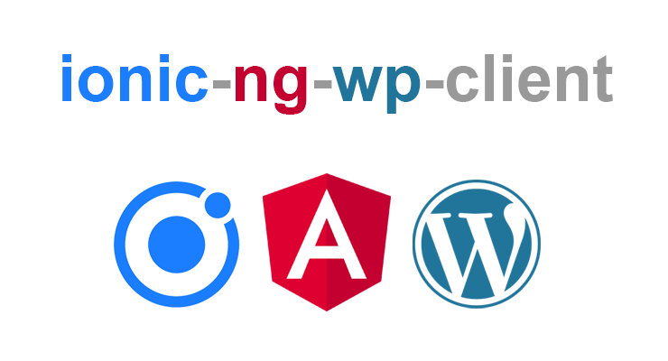

# IonPress

  

A Progressive Web App (PWA) built with Ionic, Angular, and the WordPress REST API.
The goal of this project is to provide a service-oriented front-end to WordPress for desktop and mobile.
Use it to create a unique experience for your website or blog and to learn about modern web development 
using popular frameworks and tools.

To learn how this project was created from beginning to end, see the companion developer log:

[How to build a PWA with Ionic, Angular, and the WordPress REST API – Part 1](https://codyburleson.com/pwa-with-ionic-angular-wordpress-api-1)

## Getting started

- Install the latest versions of Node.js and npm if you don't already have them.
- Clone this repo from GitHub
- `cd` into the project root directory
- Run `npm install` to install the dependencies, which are defined in `package.json`
- Configure `src/environments/environment.ts` and `environment.prod.ts` to suit your environment and preferences
- Run `ionic serve` to run the app and open your browser to http://localhost:8100/home

## WordPress requirements

The WordPress REST API endpoint, `/wp-json/wp/v2`, is available when you set your site to use the custom permalink 
setting. We recommend the `Post name` option (`/%postname%/`) as that is the option this app is currently developed and 
tested against. After saving the permalink settings, you should be able to verify a JSON response is returned from the 
following URL:

http://<host>:<port>/wp-json/wp/v2/posts

## Setup a WordPress development environment

To setup a local WordPress instance for development purposes, run the following command from within
the project's root directory:

`$ docker-compose up -d`

This uses the docker-compose.yml file to create an environment consisting of two Docker containers - 
one for the database and one for the web server. It also brings in all the WordPress files needed to 
run WordPress. The WordPress installation files are saved in the `wp/` directory of the project root 
and they are mapped into the web server container. The `wp/` directory is ignored in the `.gitignore` file, 
so you will only find it after running the `docker-compose up -d` command. Of course, alternatively, you can use your 
own LAMP stack, MAMP, production instance or whatever.

Point your browser to http://localhost:8080/ to complete the WordPress setup.

The WordPress REST API endpoint, `/wp-json/wp/v2`, is available when you set your site to use the custom permalink 
setting. We recommend the `Post name` option (`/%postname%/`) as that is the option this app is currently developed and 
tested against. After saving the permalink settings, you should be able to verify a JSON response is returned from the 
following URL:

http://localhost:8080/wp-json/wp/v2/posts

### Recommended WordPress plugins

- [FakerPress](https://wordpress.org/plugins/fakerpress/) - to create dummy data for development purposes

## Command reference

| Command | Description |
| --- | --- |
| `npm install` | Install project dependencies, which are defined in `package.json` |
| `ionic serve` | Run the app at (http://localhost:8100) |
| `docker-compose up -d` | Start the local WordPress dev environment (at http://localhost:8080/) |
| `docker-compose logs -f` | Follow the container logs |
| `docker-compose stop` | Stop the local WordPress dev environment (Docker containers); restart with `docker-compose up -d` |
| `ng test` | Execute the Jasmine tests |

